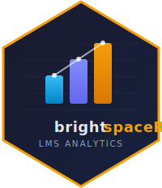

# brightspaceR 

<!-- badges: start -->
[](https://lifecycle.r-lib.org/articles/stages.html#experimental)
<!-- badges: end -->

**Full documentation: <https://pcstrategyandopsco.github.io/brightspaceR/>**

## The problem

Brightspace Data Sets (BDS) give you access to the raw data behind your LMS --
users, enrollments, grades, content activity, quiz attempts, discussion posts --
but working with them is tedious. You authenticate via OAuth2, hit a paginated
API to find available extracts, download ZIP files, unzip CSVs, figure out which
columns are dates vs strings vs booleans, convert PascalCase names to something
R-friendly, and then manually join tables on the right ID columns. Every time.

brightspaceR does all of that in one line:

```r
users <- bs_get_dataset("Users")
```

You get back a tidy tibble with proper column types, snake_case names, and
dates parsed as POSIXct. The package knows the schemas for ~20 common BDS
datasets and will intelligently coerce types even for datasets it hasn't seen
before.

## What it does

**Authenticate** once via OAuth2. Tokens are cached to disk and refreshed
automatically -- no re-authentication on every script run.

```r
library(brightspaceR)
bs_auth()
```

**Discover** what's available. List all datasets, search by keyword, inspect
schemas:

```r
bs_list_datasets()
bs_get_schema("grade_results")
```

**Download** any dataset as a typed tibble:

```r
users       <- bs_get_dataset("Users")
enrollments <- bs_get_dataset("User Enrollments")
grades      <- bs_get_dataset("Grade Results")
```

**Join** related datasets. BDS tables are normalized -- users, enrollments,
grades, and org units live in separate tables linked by ID columns. brightspaceR
knows the foreign key relationships:

```r
# Smart join -- auto-detects shared key columns
bs_join(users, enrollments)

# Or use named joins for explicit, self-documenting code
enrollments |>
  bs_join_enrollments_roles(bs_get_dataset("Role Details")) |>
  bs_join_enrollments_orgunits(bs_get_dataset("Org Units"))
```

**Chain joins** to build complete analytical datasets in one pipeline:

```r
grade_report <- bs_get_dataset("User Enrollments") |>
  bs_join_enrollments_grades(bs_get_dataset("Grade Results")) |>
  bs_join_grades_objects(bs_get_dataset("Grade Objects"))
```

**Advanced Data Sets (ADS)** for ad-hoc exports like Learner Usage (requires
`reporting:*` scopes -- see the
[setup guide](https://pcstrategyandopsco.github.io/brightspaceR/articles/setup.html)):

```r
usage <- bs_get_ads("Learner Usage")
```

ADS functions fail gracefully if scopes aren't configured -- BDS access still
works without them.

**Analyse** with built-in analytics functions or standard dplyr:

```r
# Student engagement per course
engagement <- bs_course_engagement(usage)

# Identify at-risk students
at_risk <- bs_identify_at_risk(usage, thresholds = list(progress = 30))

# Course-level dashboard
dashboard <- bs_course_summary(usage)

# Retention and dropout rates
retention <- bs_retention_summary(usage, by = "course")
```

Or use dplyr directly:

```r
library(dplyr)

# Enrollment counts by role
enrollments |>
  bs_join_enrollments_roles(bs_get_dataset("Role Details")) |>
  count(role_name, sort = TRUE)

# Average grade per course
grades |>
  filter(!is.na(points_numerator)) |>
  group_by(org_unit_id) |>
  summarise(mean_grade = mean(points_numerator, na.rm = TRUE))
```

## Installation

```r
# install.packages("pak")
pak::pak("pcstrategyandopsco/brightspaceR")
```

You'll need to register an OAuth2 application in your Brightspace instance
before using the package. The
[setup guide](https://pcstrategyandopsco.github.io/brightspaceR/articles/setup.html)
walks through every step: app registration, scopes, redirect URIs, config file,
and troubleshooting.

## MCP server for AI-assisted analytics

brightspaceR includes an MCP (Model Context Protocol) server that lets AI
assistants query your Brightspace data directly. Instead of you writing R code,
you describe what you want in plain language. The assistant discovers datasets,
writes the R code to aggregate and join them, and returns the results -- text
summaries, tables, and interactive Chart.js visualisations.

Example conversation:

> **You:** How are students performing in STAT101?
>
> The assistant finds the Grade Results dataset, filters to STAT101, and returns
> summary statistics and an interactive grade distribution chart -- all without
> you writing a line of code.

The server exposes 7 tools: dataset discovery, column-level statistics,
filtered/grouped summaries, and a safety-checked R execution environment with a
persistent workspace. It runs locally, uses your existing OAuth2 credentials, and
produces self-contained HTML charts you can share with colleagues. Built-in
security layers include AST code inspection (blocks shell commands, file I/O,
direct API access), PII field policies (strips names, emails, and comments from
datasets before they reach the model), and audit logging (JSONL record of every
tool call).

### Setup

The MCP server works with both **Claude Desktop** and **Claude Code (CLI)**.
Add this to your configuration (see the
[full setup guide](https://pcstrategyandopsco.github.io/brightspaceR/articles/mcp-setup.html)
for platform-specific paths and Claude Code instructions):

**Claude Desktop** (`claude_desktop_config.json`):

```json
{
  "mcpServers": {
    "brightspaceR": {
      "command": "Rscript",
      "args": ["<path-to>/brightspaceR/inst/mcp/server.R"],
      "cwd": "<path-to-project-with-config-yml>"
    }
  }
}
```

**Claude Code** (`~/.claude.json` or project `.mcp.json`):

```json
{
  "mcpServers": {
    "brightspaceR": {
      "command": "Rscript",
      "args": ["<path-to>/brightspaceR/inst/mcp/server.R"],
      "cwd": "<path-to-project-with-config-yml>"
    }
  }
}
```

See the [MCP Setup Guide](https://pcstrategyandopsco.github.io/brightspaceR/articles/mcp-setup.html) for prerequisites, environment variables, and troubleshooting, and the [MCP Server Design](https://pcstrategyandopsco.github.io/brightspaceR/articles/mcp-server-design.html) article for architecture details and example workflows.

## Building dashboards and apps

The package is designed to support reporting workflows beyond one-off scripts.
The documentation includes complete, working examples:

- [**Interactive Dashboard**](https://pcstrategyandopsco.github.io/brightspaceR/articles/interactive-dashboard.html) --
  Build a self-contained HTML dashboard using R Markdown and Chart.js. knitr
  inline R expressions inject aggregated data directly into JavaScript chart
  definitions. The result is a single HTML file you can open in any browser or
  share with colleagues -- no R or Shiny required to view it. Supports
  parameterised reports for different date ranges or semesters.

- [**Shiny App**](https://pcstrategyandopsco.github.io/brightspaceR/articles/shiny-app.html) --
  A complete Shiny application with sidebar filters (role, course, date range),
  KPI cards, four ggplot2 charts, and a DT data table. Includes sections on
  adding plotly interactivity, download buttons, scheduled data refresh, and
  deploying to Posit Connect.

## Articles

| | |
|---|---|
| [OAuth2 Setup](https://pcstrategyandopsco.github.io/brightspaceR/articles/setup.html) | App registration, credentials, config file, troubleshooting |
| [Getting Started](https://pcstrategyandopsco.github.io/brightspaceR/articles/getting-started.html) | First dataset download, joins, schemas, column types |
| [Convenience Functions](https://pcstrategyandopsco.github.io/brightspaceR/articles/convenience-functions.html) | All 7 join functions, schema registry, common analytical patterns |
| [Interactive Dashboard](https://pcstrategyandopsco.github.io/brightspaceR/articles/interactive-dashboard.html) | R Markdown + Chart.js, parameterised reports |
| [Shiny App](https://pcstrategyandopsco.github.io/brightspaceR/articles/shiny-app.html) | Full app with filters, charts, data tables, deployment |
| [MCP Server Design](https://pcstrategyandopsco.github.io/brightspaceR/articles/mcp-server-design.html) | Architecture, 7-tool reference, analysis types, conversation flows |

## License

MIT
